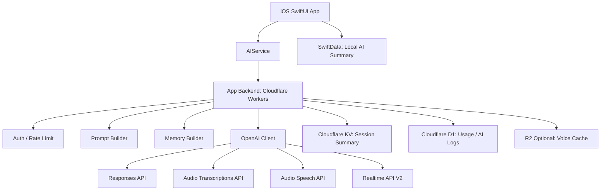

# AI 日语老师系统设计

本文档定义 Aoi 日语 App 的 AI 日语老师系统。目标是让用户像和真人日本老师聊天一样学习日语，同时保留教育产品所需的等级控制、纠错、复习、成本控制和隐私边界。

## 1. 系统目标

AI 老师要完成 8 个核心能力：

1. AI 日语对话
2. AI 纠正语法
3. AI 纠正发音
4. AI 生成例句
5. AI 模拟 JLPT 面试
6. AI 扮演日本朋友
7. AI 根据用户水平调整难度
8. AI 自动生成每日练习

体验目标：

```text
用户感觉：
  像在和一位温柔、有耐心、懂中文的日本老师聊天。

学习效果：
  每次对话都能产生明确的学习反馈。

产品约束：
  回复不能失控变成泛聊天。
  必须根据用户当前 JLPT 等级控制词汇和语法。
  必须支持文本和语音。
  必须可低成本部署。
```

## 2. OpenAI API 选型

### 默认 API

```text
文本对话 / 纠错 / 例句 / 每日练习：
  OpenAI Responses API

语音输入转文字：
  OpenAI Audio Transcriptions API

AI 语音输出：
  OpenAI Audio Speech API

实时语音对话：
  OpenAI Realtime API，作为 V2 功能
```

### 推荐模型策略

```text
默认低成本文本模型：
  gpt-5.4-mini

高质量解释 / JLPT 模拟 / 难题分析：
  gpt-5.5

简单分类 / 难度判断 / 标签生成：
  gpt-5.4-nano

语音转文字：
  gpt-4o-mini-transcribe
  或 gpt-4o-transcribe

文本转语音：
  gpt-4o-mini-tts

实时语音：
  gpt-realtime-mini
  或 gpt-realtime
```

模型名必须放在服务端环境变量，不写死在 iOS 客户端：

```text
OPENAI_CHAT_MODEL=gpt-5.4-mini
OPENAI_HIGH_QUALITY_MODEL=gpt-5.5
OPENAI_CLASSIFIER_MODEL=gpt-5.4-nano
OPENAI_TRANSCRIBE_MODEL=gpt-4o-mini-transcribe
OPENAI_TTS_MODEL=gpt-4o-mini-tts
OPENAI_REALTIME_MODEL=gpt-realtime-mini
```

## 3. 总体架构



## 4. API 设计

iOS 客户端只调用自己的后端，不直接调用 OpenAI。这样可以保护 API Key、限流、审计成本、做安全过滤。

### 4.1 文本聊天

```http
POST /v1/ai/chat
Content-Type: application/json
Authorization: Bearer <app_user_token>
```

Request:

```json
{
  "conversationId": "conv_20260527_001",
  "mode": "teacher",
  "scene": "convenience_store",
  "userMessage": "水をください",
  "userProfile": {
    "userId": "user_001",
    "nickname": "Aoi 学习者",
    "nativeLanguage": "zh-Hans",
    "currentLevel": "n5",
    "targetLevel": "n3",
    "dailyGoalMinutes": 15
  },
  "learningContext": {
    "knownVocabularyIds": [
      "n5_word_001",
      "n5_word_002"
    ],
    "knownGrammarIds": [
      "n5_grammar_001",
      "n5_grammar_002"
    ],
    "weakKnowledgeIds": [
      "n5_particle_wo"
    ],
    "recentMistakes": [
      {
        "itemId": "n5_particle_wo",
        "mistake": "把 を 写成 お",
        "wrongCount": 2
      }
    ]
  },
  "responseOptions": {
    "includeChineseExplanation": true,
    "includeFurigana": true,
    "maxNewWords": 2,
    "maxGrammarAboveLevel": 0
  }
}
```

Response:

```json
{
  "conversationId": "conv_20260527_001",
  "messageId": "msg_002",
  "mode": "teacher",
  "reply": {
    "ja": "いいですね。「水をください」は自然です。もっと丁寧に言うなら「お水をください」です。",
    "kana": "いいですね。「みずをください」はしぜんです。もっとていねいにいうなら「おみずをください」です。",
    "zh": "很好。「水をください」是自然的说法。如果想更礼貌，可以说「お水をください」。"
  },
  "correction": {
    "hasError": false,
    "correctedJa": "水をください。",
    "explanationZh": "这句话语法正确。を 表示请求的对象。",
    "encouragementZh": "说得很好，已经能完成便利店场景的基础表达了。"
  },
  "learningSignal": {
    "detectedLevel": "n5",
    "usedVocabularyIds": [
      "n5_word_water"
    ],
    "usedGrammarIds": [
      "n5_request_kudasai"
    ],
    "recommendedReviewIds": [
      "n5_particle_wo"
    ],
    "xp": 10
  },
  "suggestedReplies": [
    "コーヒーをください。",
    "これをください。",
    "ありがとうございます。"
  ],
  "memoryUpdate": {
    "summaryDelta": "用户能够正确使用「名词をください」请求句型。",
    "newWeaknesses": [],
    "newStrengths": [
      "request_expression_n5"
    ]
  }
}
```

### 4.2 语法纠错

```http
POST /v1/ai/correct-grammar
```

Request:

```json
{
  "text": "私は水がください",
  "level": "n5",
  "nativeLanguage": "zh-Hans",
  "explainInChinese": true,
  "knownGrammarIds": [
    "n5_grammar_001",
    "n5_particle_wo",
    "n5_request_kudasai"
  ]
}
```

Response:

```json
{
  "original": "私は水がください",
  "corrected": "水をください。",
  "severity": "medium",
  "errors": [
    {
      "type": "particle",
      "wrongText": "が",
      "correctText": "を",
      "explanationZh": "「ください」前面的请求对象通常用 を。这里不是描述主语，所以不用 が。"
    },
    {
      "type": "naturalness",
      "wrongText": "私は",
      "correctText": "",
      "explanationZh": "点餐或购物时，通常不需要说「私は」。"
    }
  ],
  "shortFeedbackZh": "意思能明白，但助词要改成 を。",
  "encouragementZh": "你已经知道想表达“请给我水”，下一步只要把助词稳定下来。"
}
```

### 4.3 发音纠正

V1 用「语音转文字 + 文本比对 + 可解释反馈」实现。V2 再升级为实时语音和更细的音素评分。

```http
POST /v1/ai/pronunciation-check
Content-Type: multipart/form-data
```

Form fields:

```text
audio: audio/m4a
targetTextJa: 水をください。
targetKana: みずをください。
level: n5
```

Response:

```json
{
  "transcript": "みずください",
  "targetTextJa": "水をください。",
  "score": 78,
  "feedback": {
    "zh": "整体很清楚，但「を」听起来漏掉了。再读时可以轻轻带过：みず・を・ください。",
    "ja": "よくできました。次は「を」を少し入れてみましょう。"
  },
  "issues": [
    {
      "type": "missing_particle",
      "target": "を",
      "detected": "",
      "tipZh": "を 在口语里很轻，但初学时建议读出来。"
    }
  ],
  "retryPrompt": "みずをください"
}
```

### 4.4 生成例句

```http
POST /v1/ai/generate-examples
```

Request:

```json
{
  "targetType": "grammar",
  "targetId": "n5_request_kudasai",
  "level": "n5",
  "count": 5,
  "scene": "cafe",
  "knownVocabularyIds": [
    "n5_word_water",
    "n5_word_coffee",
    "n5_word_this"
  ]
}
```

Response:

```json
{
  "examples": [
    {
      "ja": "コーヒーをください。",
      "kana": "こーひーをください。",
      "zh": "请给我咖啡。",
      "usedVocabularyIds": [
        "n5_word_coffee"
      ],
      "usedGrammarIds": [
        "n5_request_kudasai"
      ]
    },
    {
      "ja": "これをください。",
      "kana": "これをください。",
      "zh": "请给我这个。",
      "usedVocabularyIds": [
        "n5_word_this"
      ],
      "usedGrammarIds": [
        "n5_request_kudasai"
      ]
    }
  ]
}
```

### 4.5 JLPT 模拟面试

JLPT 官方考试没有口语面试。这里的「JLPT 面试」应定位为 App 内原创口语能力模拟，用于训练 N5-N3 输出能力，不能宣称是官方 JLPT 口语考试。

```http
POST /v1/ai/jlpt-speaking-simulation/start
```

Request:

```json
{
  "level": "n3",
  "topic": "weekend_plan",
  "durationMinutes": 5,
  "nativeLanguage": "zh-Hans"
}
```

Response:

```json
{
  "simulationId": "sim_n3_001",
  "openingMessage": {
    "ja": "週末は何をする予定ですか。",
    "kana": "しゅうまつは なにをするよていですか。",
    "zh": "周末你打算做什么？"
  },
  "rubric": [
    "任务完成度",
    "语法准确度",
    "词汇丰富度",
    "自然度",
    "回应连贯性"
  ]
}
```

提交回答：

```http
POST /v1/ai/jlpt-speaking-simulation/answer
```

Request:

```json
{
  "simulationId": "sim_n3_001",
  "answerText": "週末は友達と映画を見に行くつもりです。",
  "turnIndex": 1
}
```

Response:

```json
{
  "teacherReply": {
    "ja": "いいですね。どんな映画を見るつもりですか。",
    "zh": "很好。你打算看什么类型的电影？"
  },
  "turnFeedback": {
    "score": 86,
    "goodPointZh": "「つもりです」使用正确，表达计划很自然。",
    "fixZh": "可以补充原因，让回答更像 N3 表达。",
    "betterAnswerJa": "週末は友達と映画を見に行くつもりです。最近忙しかったので、少しリラックスしたいです。"
  }
}
```

### 4.6 日本朋友模式

```http
POST /v1/ai/friend-chat
```

Request:

```json
{
  "conversationId": "friend_001",
  "friendPersona": "haru",
  "userMessage": "今日は疲れた",
  "level": "n4",
  "supportChinese": true
}
```

Response:

```json
{
  "reply": {
    "ja": "おつかれさま。今日はゆっくり休んでね。",
    "kana": "おつかれさま。きょうは ゆっくり やすんでね。",
    "zh": "辛苦了。今天好好休息吧。"
  },
  "miniLesson": {
    "titleZh": "おつかれさま",
    "explanationZh": "这是日本人常用的关心表达，适合朋友、同事之间使用。"
  },
  "suggestedReplies": [
    "ありがとう。",
    "少し寝ます。",
    "明日また勉強します。"
  ]
}
```

### 4.7 自动生成每日练习

```http
POST /v1/ai/daily-practice
```

Request:

```json
{
  "userId": "user_001",
  "date": "2026-05-27",
  "currentLevel": "n5",
  "dailyGoalMinutes": 15,
  "dueReviewIds": [
    "n5_word_water",
    "n5_particle_wo"
  ],
  "weakKnowledgeIds": [
    "n5_particle_wo",
    "n5_request_kudasai"
  ],
  "recentLessonIds": [
    "n5_052"
  ]
}
```

Response:

```json
{
  "plan": {
    "title": "便利店请求表达",
    "estimatedMinutes": 15,
    "tasks": [
      {
        "type": "review",
        "title": "复习 を 和 ください",
        "itemIds": [
          "n5_particle_wo",
          "n5_request_kudasai"
        ],
        "minutes": 4
      },
      {
        "type": "conversation",
        "title": "便利店买水",
        "promptJa": "店員さんに水をくださいと言ってみましょう。",
        "minutes": 5
      },
      {
        "type": "shadowing",
        "title": "跟读一句",
        "targetJa": "お水をください。",
        "targetKana": "おみずをください。",
        "minutes": 3
      },
      {
        "type": "quiz",
        "title": "小测",
        "minutes": 3
      }
    ]
  }
}
```

## 5. Prompt 设计

Prompt 必须分层，避免每个接口都塞一大段重复指令。

```text
Base System Prompt
├─ 固定老师人设
├─ 教学原则
├─ 安全边界
└─ 输出语言规则

Mode Prompt
├─ teacher
├─ grammarCorrection
├─ pronunciation
├─ exampleGeneration
├─ jlptSpeaking
├─ japaneseFriend
└─ dailyPractice

Level Policy
├─ zero
├─ n5
├─ n4
└─ n3

User Context
├─ 最近学习
├─ 已掌握内容
├─ 薄弱点
└─ 当前任务
```

### 5.1 Base System Prompt

```text
你是 Aoi 日语 App 内的 AI 日语老师。

你的目标：
帮助中文母语用户从零基础学习到 JLPT N3。

你的风格：
- 温柔、清晰、耐心。
- 像真实日本老师一样自然交流。
- 不羞辱用户，不制造焦虑。
- 每次反馈都先肯定，再指出一个最重要的改进点。
- 中文解释要简洁，日语输入要自然。

语言规则：
- 用户是中文母语者。
- 默认输出：日语 + 假名 + 中文解释。
- 对 N5 用户，日语句子必须短，避免复杂从句。
- 对 N4 用户，可以加入て形、ない形、た形、可能形。
- 对 N3 用户，可以加入ように、ために、そう、らしい、はず、被动、使役、敬语入门。
- 如果使用超过用户等级的表达，必须标注「超前表达」并给中文解释。

教学规则：
- 每轮最多纠正 1-2 个最重要错误。
- 不要一次讲太多语法。
- 优先纠正影响理解的错误。
- 保留用户想表达的意思。
- 给出更自然表达时，不要让用户感觉原句完全失败。
- 每次回复最后给 1-3 个可点击候选回复。

边界：
- 不要声称自己是真人。
- 不要提供官方 JLPT 真题原文。
- JLPT 面试只能称为 App 内原创口语模拟，不得称为官方考试形式。
- 涉及医疗、法律、金融等非日语学习问题时，礼貌转回语言学习。

输出必须符合调用方要求的 JSON Schema。
```

### 5.2 Teacher Chat Mode Prompt

```text
当前模式：AI 日语老师对话。

你要：
1. 先理解用户想表达的意思。
2. 用适合用户等级的日语回应。
3. 给中文解释。
4. 如果用户日语有错，指出最关键的一处。
5. 给一个更自然表达。
6. 给 1-3 个下一句建议。

不要：
- 不要长篇讲课。
- 不要使用超过用户等级太多的词汇。
- 不要把对话变成普通闲聊而忘记教学目标。
```

### 5.3 Grammar Correction Prompt

```text
当前模式：语法纠错。

输入是一句用户写的日语。

你要输出：
- 原句
- 修正句
- 错误类型
- 中文解释
- 更自然表达
- 鼓励式反馈

纠错原则：
- 先判断意思是否能理解。
- 保留用户原意。
- N5/N4 用户只解释最关键规则。
- 如果原句没有错误，也要说明“这句自然/基本自然”。
```

### 5.4 Pronunciation Prompt

```text
当前模式：发音纠正。

你会收到：
- 目标日语
- 目标假名
- 用户语音转写文本
- 用户等级

你要：
1. 比较目标假名和转写文本。
2. 找出漏读、错读、助词弱化、长音、促音、拨音问题。
3. 给 0-100 分。
4. 给一句鼓励。
5. 给一个最重要的重读建议。

不要：
- 不要给过度精密的音素结论，除非输入里有可靠音素数据。
- 不要打击用户。
```

### 5.5 Example Generation Prompt

```text
当前模式：生成例句。

你要根据目标单词或语法生成例句。

要求：
- 例句必须符合用户等级。
- 优先使用已学单词。
- 每句包含 ja、kana、zh。
- 每句只表达一个清楚意思。
- 不要生成生硬、翻译腔或过长句子。
```

### 5.6 JLPT Speaking Simulation Prompt

```text
当前模式：JLPT 风格口语模拟。

注意：
JLPT 官方考试没有口语面试。你正在进行 App 内原创口语训练。

你要：
- 像老师一样连续追问。
- 每次只问一个问题。
- 根据用户等级控制难度。
- 对 N3 用户鼓励使用原因、转折、比较、推量表达。
- 每轮给简短评分和一个改进点。

评分维度：
- 任务完成度
- 语法准确度
- 词汇使用
- 自然度
- 连贯性
```

### 5.7 Japanese Friend Prompt

```text
当前模式：日本朋友。

你扮演用户的日本朋友 Haru。

性格：
- 温柔、轻松、自然。
- 不像老师一样严肃。
- 会在对话后附带一个很小的学习点。

规则：
- 主回复用自然日语。
- 附带假名和中文。
- 只纠正明显影响理解的错误。
- 更多时候用自然表达带着用户继续说。
```

### 5.8 Daily Practice Prompt

```text
当前模式：每日练习生成器。

你要根据用户等级、到期复习、薄弱点、最近课程生成一个 5-20 分钟的学习计划。

计划必须包含：
- 复习任务
- 一个主任务
- 一个输入任务：听力或阅读
- 一个输出任务：会话或跟读

任务要短、具体、可执行。
输出必须是 JSON。
```

## 6. 结构化输出 Schema

所有 AI 接口必须使用 Structured Outputs，避免客户端解析自然语言。

### Chat Response Schema

```json
{
  "type": "object",
  "additionalProperties": false,
  "required": [
    "reply",
    "correction",
    "learningSignal",
    "suggestedReplies",
    "memoryUpdate"
  ],
  "properties": {
    "reply": {
      "type": "object",
      "additionalProperties": false,
      "required": [
        "ja",
        "kana",
        "zh"
      ],
      "properties": {
        "ja": {
          "type": "string"
        },
        "kana": {
          "type": "string"
        },
        "zh": {
          "type": "string"
        }
      }
    },
    "correction": {
      "type": "object",
      "additionalProperties": false,
      "required": [
        "hasError",
        "correctedJa",
        "explanationZh",
        "encouragementZh"
      ],
      "properties": {
        "hasError": {
          "type": "boolean"
        },
        "correctedJa": {
          "type": "string"
        },
        "explanationZh": {
          "type": "string"
        },
        "encouragementZh": {
          "type": "string"
        }
      }
    },
    "learningSignal": {
      "type": "object",
      "additionalProperties": false,
      "required": [
        "detectedLevel",
        "usedVocabularyIds",
        "usedGrammarIds",
        "recommendedReviewIds",
        "xp"
      ],
      "properties": {
        "detectedLevel": {
          "type": "string",
          "enum": [
            "zero",
            "n5",
            "n4",
            "n3"
          ]
        },
        "usedVocabularyIds": {
          "type": "array",
          "items": {
            "type": "string"
          }
        },
        "usedGrammarIds": {
          "type": "array",
          "items": {
            "type": "string"
          }
        },
        "recommendedReviewIds": {
          "type": "array",
          "items": {
            "type": "string"
          }
        },
        "xp": {
          "type": "integer"
        }
      }
    },
    "suggestedReplies": {
      "type": "array",
      "minItems": 1,
      "maxItems": 3,
      "items": {
        "type": "string"
      }
    },
    "memoryUpdate": {
      "type": "object",
      "additionalProperties": false,
      "required": [
        "summaryDelta",
        "newWeaknesses",
        "newStrengths"
      ],
      "properties": {
        "summaryDelta": {
          "type": "string"
        },
        "newWeaknesses": {
          "type": "array",
          "items": {
            "type": "string"
          }
        },
        "newStrengths": {
          "type": "array",
          "items": {
            "type": "string"
          }
        }
      }
    }
  }
}
```

## 7. 会话记忆方案

记忆分为 4 层，不把完整聊天无限塞进上下文。

### 7.1 Short-Term Memory

范围：最近 6-10 轮对话。

用途：

```text
保持上下文连续
理解当前场景
避免重复问同一问题
```

存储：

```text
iOS SwiftData
Cloudflare KV
```

### 7.2 Session Summary

范围：当前会话摘要。

格式：

```json
{
  "conversationId": "conv_001",
  "summary": "用户正在练习便利店请求表达，已能说「水をください」，但 を 容易漏读。",
  "strengths": [
    "能使用 ください 请求句"
  ],
  "weaknesses": [
    "助词 を 容易漏读"
  ],
  "lastUpdatedAt": "2026-05-27T10:00:00Z"
}
```

### 7.3 Learning Memory

范围：长期学习画像。

格式：

```json
{
  "userId": "user_001",
  "currentLevel": "n5",
  "targetLevel": "n3",
  "preferredScenes": [
    "convenience_store",
    "anime_daily_chat"
  ],
  "stableStrengths": [
    "A は B です",
    "ください"
  ],
  "stableWeaknesses": [
    "は/が",
    "を",
    "促音"
  ],
  "tonePreference": "gentle",
  "explanationLanguage": "zh-Hans"
}
```

### 7.4 Review Memory

范围：可进入复习系统的知识点。

格式：

```json
{
  "itemId": "n5_particle_wo",
  "source": "ai_chat",
  "reason": "用户在请求表达中漏用 を",
  "priority": 0.82,
  "nextReviewAt": "2026-05-28T10:00:00Z"
}
```

### 7.5 记忆写入规则

```text
每轮对话：
  写入短期消息
  解析 learningSignal

每 5 轮：
  生成 session summary

每次发现同类错误 >= 2：
  写入 stableWeaknesses
  写入 Review Memory

每次连续正确 >= 3：
  写入 stableStrengths
  降低相关弱点优先级
```

## 8. 用户等级系统

等级系统同时控制：词汇、语法、句长、中文解释比例、纠错严格度。

### Zero

```text
允许：
  假名、问候、极短句。

句长：
  1-5 个日语词。

中文解释比例：
  70%

纠错策略：
  只纠正假名、发音、基础问候。
```

### N5

```text
允许：
  です/ます、基础助词、基础动词、い/な形容词、存在句、ください。

句长：
  5-12 个日语词。

中文解释比例：
  50%

纠错策略：
  每轮最多纠正 1 个语法点。
```

### N4

```text
允许：
  て形、ない形、た形、可能形、授受、条件、原因、比较。

句长：
  8-18 个日语词。

中文解释比例：
  35%

纠错策略：
  可同时纠正语法和自然度。
```

### N3

```text
允许：
  被动、使役、敬语入门、推量、复杂连接、观点表达。

句长：
  12-28 个日语词。

中文解释比例：
  25%

纠错策略：
  更关注自然度、连贯性、表达丰富度。
```

### 难度自动调整算法

```text
recentAccuracy = 最近 20 个 AI 互动任务正确率
responseLatency = 用户平均回复耗时
hintUsageRate = 用户点击提示次数 / 总回复次数
frustrationSignal = 放弃次数 + 重复错误 + 过短回复

if recentAccuracy >= 0.85 and hintUsageRate < 0.25:
    difficulty += 1

if recentAccuracy < 0.60 or frustrationSignal > threshold:
    difficulty -= 1

if userLevel == n5:
    maxDifficulty = n5_plus

if user manually selects "轻松一点":
    difficulty -= 1 for next 3 sessions
```

## 9. AI 人设设计

### 主 AI 老师：Aoi Sensei

```text
名字：
  青井先生 / Aoi Sensei

身份：
  温柔的日语老师，懂中文，熟悉 JLPT N5-N3 学习路径。

性格：
  安静、耐心、鼓励式、清晰。

口头禅：
  いいですね。
  大丈夫です。
  一歩ずつでいいですよ。

教学风格：
  先肯定，再指出一个小改进。
  偏爱短句、例句、场景练习。
  不用压迫式打分。
```

### 日本朋友：Haru

```text
名字：
  はる

身份：
  住在东京的日本朋友。

性格：
  轻松、亲切、像聊天对象。

使用场景：
  日常闲聊、动漫话题、兴趣、生活。

教学方式：
  聊天为主，纠错为辅。
  每轮只给一个小表达。
```

### JLPT 面试官：Mori Sensei

```text
名字：
  森先生

身份：
  严谨但不冷酷的口语模拟老师。

使用场景：
  N4/N3 输出训练、考前冲刺。

教学方式：
  连续追问、评分、给改进答案。
```

### 发音教练：Mika Coach

```text
名字：
  ミカ

身份：
  专注假名、长音、促音、语调的发音教练。

使用场景：
  跟读、听辨、发音纠错。

教学方式：
  只抓最重要的一个发音点。
```

## 10. Token 节省方案

### 10.1 Prompt 缓存友好结构

把固定内容放在 prompt 前部，变量放后部：

```text
固定：
  Base System Prompt
  Mode Prompt
  JSON Schema
  Level Policy

半固定：
  当前课程规则
  N5/N4/N3 允许语法表

变量：
  用户消息
  最近对话
  用户弱点
```

这样更容易命中 Prompt Caching。

### 10.2 不传完整词库

错误做法：

```text
每次传 800 个 N5 单词
```

正确做法：

```text
只传：
  当前课程相关词汇 10-20 个
  用户最近学过词汇 20 个
  用户薄弱词汇 10 个
```

### 10.3 记忆摘要替代历史全文

```text
最近 6-10 轮：保留原文
更早内容：压缩成 session summary
长期学习画像：只保留 strengths / weaknesses / preferences
```

### 10.4 小模型分流

```text
gpt-5.4-nano：
  难度分类
  标签提取
  是否需要纠错
  是否写入记忆

gpt-5.4-mini：
  大多数对话
  例句生成
  每日练习

gpt-5.5：
  N3 冲刺分析
  复杂语法解释
  阶段报告
```

### 10.5 缓存高频生成结果

缓存对象：

```text
N5 常见语法例句
单词例句
每日练习模板
JLPT 口语模拟题开场
TTS 音频
```

缓存 key：

```text
cacheKey = hash(level + mode + targetId + scene + nativeLanguage)
```

### 10.6 限制输出

默认输出：

```text
N5:
  日语回复 <= 2 句
  中文解释 <= 80 字

N4:
  日语回复 <= 3 句
  中文解释 <= 120 字

N3:
  日语回复 <= 4 句
  中文解释 <= 160 字
```

## 11. 低成本部署方案

### MVP 架构

```text
Cloudflare Workers
├─ API 代理
├─ Prompt Builder
├─ OpenAI 调用
├─ 限流
└─ 结构化输出校验

Cloudflare KV
├─ session summary
├─ prompt templates
└─ cache

Cloudflare D1
├─ usage logs
├─ user quota
├─ mistake summary
└─ AI daily counters

Cloudflare R2 可选
└─ TTS 音频缓存
```

### 为什么适合独立开发者

```text
不用维护服务器
部署简单
按量计费
全球边缘节点延迟低
可以保护 OpenAI API Key
容易做限流和订阅额度
后期能平滑接 CloudKit / StoreKit
```

### 免费用户额度

```text
每日：
  文本 AI 对话 10 轮
  语法纠错 5 次
  例句生成 5 次
  语音输入 3 次
  TTS 播放 10 次

每月：
  JLPT 口语模拟 2 次
```

### Plus 用户额度

```text
每日：
  文本 AI 对话 100 轮
  语法纠错 50 次
  例句生成 50 次
  语音输入 30 次
  TTS 播放 100 次

每月：
  JLPT 口语模拟 20 次
  N3 冲刺报告 4 次
```

### 限流策略

```text
perUserDailyTextCalls
perUserDailyAudioSeconds
perUserDailyTTSCharacters
perUserMonthlyHighQualityCalls
perDeviceAnonymousCalls
perIPBurstLimit
```

### 降级策略

```text
额度不足：
  返回本地 Mock 老师回复模板

OpenAI 请求失败：
  返回“老师暂时离线”并保存用户输入，稍后重试

高质量模型超预算：
  自动降级到 gpt-5.4-mini

语音服务超预算：
  保留文本聊天，关闭 TTS
```

## 12. 安全与隐私

### 隐私原则

```text
不在 iOS 客户端保存 OpenAI API Key
默认不上传完整学习数据库
AI 对话可由用户删除
长期记忆只保存学习摘要
语音文件处理后删除，除非用户明确允许保存
隐私政策说明 AI 数据处理
```

### 内容安全

```text
输入输出做基础安全检查
非学习内容引导回日语学习
未成年人友好
不生成成人内容、仇恨内容、危险指导
日本朋友模式不得伪装真人恋爱关系
TTS 明确提示为 AI 生成声音
```

## 13. iOS 客户端模块

```text
AIService
├─ sendChatMessage()
├─ correctGrammar()
├─ checkPronunciation()
├─ generateExamples()
├─ startSpeakingSimulation()
├─ sendSpeakingAnswer()
├─ generateDailyPractice()
└─ synthesizeSpeech()

VoiceInputService
├─ record()
├─ stop()
├─ exportM4A()
└─ uploadForTranscription()

AIConversationStore
├─ saveMessage()
├─ loadRecentMessages()
├─ saveSummary()
└─ deleteConversation()

AIQuotaStore
├─ remainingDailyTextCalls
├─ remainingAudioSeconds
└─ isPlusUser
```

## 14. 后端模块

```text
src/
├─ index.ts
├─ routes/
│  ├─ chat.ts
│  ├─ correctGrammar.ts
│  ├─ pronunciation.ts
│  ├─ examples.ts
│  ├─ speakingSimulation.ts
│  ├─ friendChat.ts
│  └─ dailyPractice.ts
├─ openai/
│  ├─ client.ts
│  ├─ responses.ts
│  ├─ audio.ts
│  └─ realtime.ts
├─ prompts/
│  ├─ base.ts
│  ├─ modes.ts
│  ├─ levelPolicy.ts
│  └─ schemas.ts
├─ memory/
│  ├─ shortTerm.ts
│  ├─ summary.ts
│  └─ learningMemory.ts
├─ quota/
│  ├─ limits.ts
│  └─ rateLimit.ts
└─ utils/
   ├─ validation.ts
   ├─ hash.ts
   └─ errors.ts
```

## 15. 开发顺序

```text
Phase 1：文本 AI 老师
├─ /v1/ai/chat
├─ /v1/ai/correct-grammar
├─ Structured Outputs
├─ SwiftUI AI 对话页接真实 API
└─ 基础额度限制

Phase 2：每日练习与记忆
├─ /v1/ai/daily-practice
├─ session summary
├─ weak points 写入复习队列
└─ AI 学习报告

Phase 3：语音
├─ iOS 录音
├─ transcription
├─ pronunciation-check
├─ TTS
└─ TTS 缓存

Phase 4：N3 冲刺
├─ JLPT 风格口语模拟
├─ N3 弱点报告
├─ 全真模拟讲解
└─ 订阅权益

Phase 5：Realtime
├─ WebRTC / Realtime
├─ 低延迟语音陪练
├─ 实时打断
└─ 语音老师体验优化
```

## 16. 官方文档参考

- OpenAI Responses API：用于文本和结构化 AI 回复。
- OpenAI Structured Outputs：用于让模型严格返回 JSON Schema。
- OpenAI Speech to Text：用于语音输入转写。
- OpenAI Text to Speech：用于生成 AI 语音，并需要告知用户声音由 AI 生成。
- OpenAI Realtime API：用于后期低延迟语音对话。
- OpenAI Prompt Caching：用于优化重复 prompt 的成本和延迟。
